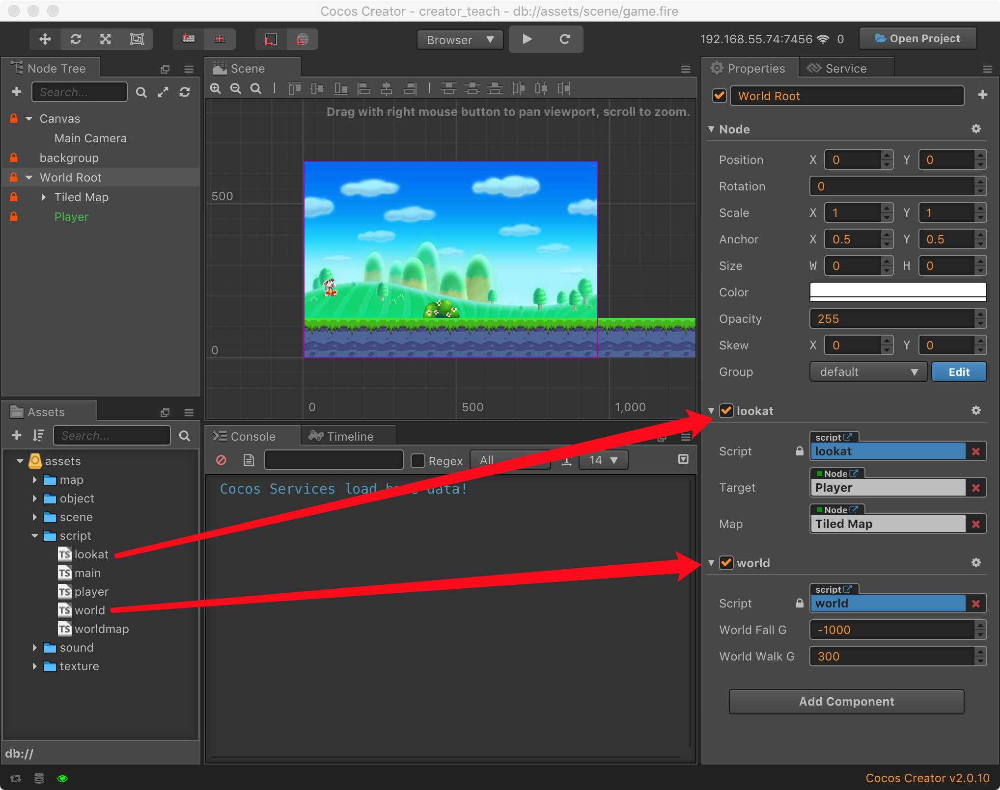

# Super Mary in CocosCreator

欢迎阅读本教程，我将演示如何灵活快速的使用 CocosCreator 来实现类似超级玛丽的横版游戏，我们会使用到下面几个模块。

[TileMap](https://docs.cocos.com/creator/manual/en/asset-workflow/tiledmap.html)

[Collision System](https://docs.cocos.com/creator/manual/en/physics/collision/)

[Prefab](https://docs.cocos.com/creator/manual/en/asset-workflow/prefab.html)

[Keyboard Event](https://docs.cocos.com/creator/manual/en/scripting/player-controls.html#keyboard-events)

[Atlas](https://docs.cocos.com/creator/manual/en/asset-workflow/atlas.html)

该教程基于 Cocos Creator v2.x 版本，点击[下载](https://cocos2d-x.org/download)并安装。

## 开始我们的游戏制作

先看下我们最后实现的效果。  (美术资源来至互联网)

## 游戏场景设计

参考超级玛丽的世界观，我们先在[节点管理器](https://docs.cocos.com/creator/manual/en/content-workflow/node-tree.html)构建我们的世界节点树，我们添加了摄像机，游戏背景层，世界根节点，地图节点，角色节点。


### 添加摄像机(Main Camera)

摄像机作为玩家观察游戏世界的窗口，Creator默认会自动为场景分配一个[摄像机](https://docs.cocos.com/creator/manual/en/render/camera.html) ，我们无需手动添加。

### 添加世界根节点(World Root)

添加一个空节点，用于放置游戏内的物体节点，并控制世界视角。

1. 创建脚本world.ts并拖入节点属性面板，用于配置游戏世界参数，比如设置重力加速度G的值。
2. 创建脚本lookat.ts并拖入节点属性面板，根据Player节点的位置同步同步世界视角。



下面是世界视角控制代码：

```typescript
const { ccclass, property } = cc._decorator;

@ccclass
export default class NewClass extends cc.Component {

    @property(cc.Node)
    target: cc.Node = null;

    @property(cc.Node)
    map: cc.Node = null;

    boundingBox: cc.Rect = null;
    screenMiddle: cc.Vec2 = null;

    minX: number = 0;
    maxX: number = 0;
    minY: number = 0;
    maxY: number = 0;

    isRun: boolean = true;

    // LIFE-CYCLE CALLBACKS:

    onLoad() {
        this.boundingBox = new cc.Rect(0, 0, this.map.width, this.map.height);
        let winsize = cc.winSize;
        this.screenMiddle = new cc.Vec2(winsize.width / 2, winsize.height / 2);
        this.minX = -(this.boundingBox.xMax - winsize.width);
        this.maxX = this.boundingBox.xMin;
        this.minY = -(this.boundingBox.yMax - winsize.height);
        this.maxY = this.boundingBox.yMin;
    }

    update() {
        if (!this.isRun) 
            return;
            
        let pos = this.node.convertToWorldSpaceAR(cc.Vec2.ZERO);
        let targertPos = this.target.convertToWorldSpaceAR(cc.Vec2.ZERO);
        let dis = pos.sub(targertPos);
        let dest = this.screenMiddle.add(dis);
        dest.x = cc.misc.clampf(dest.x, this.minX, this.maxX);
        dest.y = this.minY;
        this.node.position = this.node.parent.convertToNodeSpaceAR(dest);
    }
}
```

### 添加角色(Player)

我们控制的游戏主角节点，作为游戏世界视角的焦点，之后会有章节介绍如果制作它。

### 添加地图(Tiled Map)

将 [Tiled](https://www.mapeditor.org/) (支持 TiledMap v1.0) 制作好的地图资源 level01.tmx，拖入到世界节点下面，自动会生成地图节点，这时候可以查看展开的TiledMap地图层级。


根据 TiledMap 设计的物体类型，需要对物体进行实例化，创建waorldmap.ts脚本来完成这个工作，下面我们来配置实例化规则，配置地图层级对应的实例类型，配置实例化对应的物体的Prefab资源。


下面是水对象的实例化过程：

```typescript
// get waters layer and traverse all water objects.
var waters = this.worldMap.getObjectGroup(this.waterLayerName);
for (var i = 1; i < 8; i++) {
  var waterName = 'water' + i;
  var waterBlock = waters.getObject(waterName);
  var waterNode = cc.instantiate(this.ColliderPreName);

  // set group name for Collider System.
  waterNode.group = 'water';
  
  // set size
  waterNode.width = waterBlock.width;
  waterNode.height = waterBlock.height;
  waterNode.x = waterBlock.x;
  waterNode.y = waterBlock.y - waterBlock.height;
  
  // add collider component.
  waterNode.addComponent(cc.BoxCollider);
  waterNode.getComponent(cc.BoxCollider).size = cc.size(waterNode.width, waterNode.height);
  waterNode.getComponent(cc.BoxCollider).offset = 
    new cc.Vec2(waterNode.width / 2, -waterNode.height / 2);

  // set tag for check when collision. 
  waterNode.getComponent(cc.BoxCollider).tag = 6;
  this.node.addChild(waterNode);
}
```

### 添加碰撞规则

为世界物体添加碰撞组，来约束物体彼此之间碰撞规则，下面是创建碰撞组和碰撞组约束。


## 游戏物体设计

游戏物体会根据本身的特性去进行分类，我们选择做成预制体，例如下面是甲壳虫的资源目录，包含了甲壳虫动画文件 **beetle_anim**，预制体资源 **beetle_node**，皮肤文件 **beetle_skin**，行为控制脚本 **beetle_script**。


### 障碍物


### 方块

### 可顶撞的方块

### 蘑菇

### 甲壳虫


## 物体行为设定

为了世界的生动表现，需要脚本来给物体对象赋予生命。


### 障碍物

### 方块

### 可顶撞的方块

### 蘑菇

### 甲壳虫